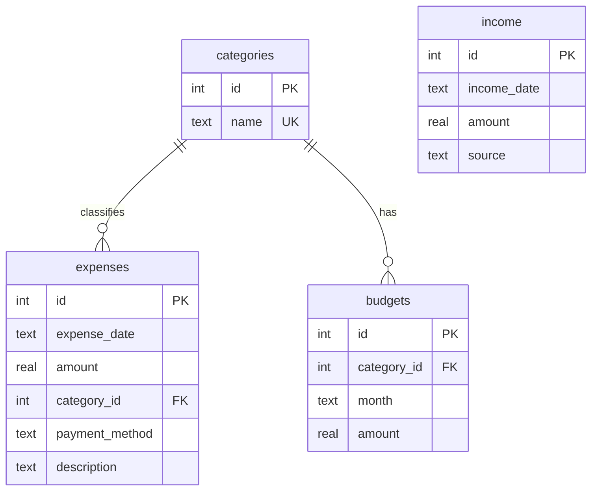

# 💰 Expense Tracker & Analytics

A personal-finance project that covers the full analyst workflow: **relational data modelling → SQL analytics → pandas analysis → interactive dashboard**, with a CLI, unit tests and a clean, lint-free codebase.

> **Note on data:** the bundled dataset is *synthetic* (12 months of INR transactions generated with a fixed random seed, including deliberately injected anomalies). Everything works identically on your own data via the CLI or the dashboard form.

## Features

| Area | What it does |
|---|---|
| **Data layer** | Normalised SQLite schema (categories, expenses, income, budgets) with constraints, foreign keys and indexes |
| **SQL analytics** | 7 reusable queries using CTEs and window functions (`LAG`, `RANK`, running totals) in [`sql/analytics_queries.sql`](sql/analytics_queries.sql) |
| **Analysis** | Month-over-month trends, category share, weekday patterns, budget utilisation, savings rate |
| **Anomaly detection** | Robust modified z-score (median/MAD) per category, which avoids the *masking* problem of mean/std |
| **Forecasting** | Next-month spend from a linear trend over the last 6 complete months, shown next to a trailing average |
| **Dashboard** | Streamlit + Plotly: filters, KPIs, 4 tabs, add-expense form, CSV export |
| **CLI** | `init`, `seed`, `add`, `list`, `delete`, `budget`, `summary`, `anomalies`, `forecast`, `export` |
| **Quality** | 35 pytest tests, Ruff lint/format, input validation, transactional DB access |

## Project structure

```
expense-tracker/
├── .vscode/                 # launch, tasks, settings, recommended extensions
├── app/dashboard.py         # Streamlit dashboard
├── data/                    # SQLite DB is created here (git-ignored)
├── docs/RESUME.md           # resume bullets + interview talking points
├── sql/
│   ├── schema.sql           # DDL: tables, constraints, indexes
│   └── analytics_queries.sql
├── src/expense_tracker/
│   ├── config.py            # settings (DB path, categories, currency)
│   ├── database.py          # connection context manager, init
│   ├── models.py            # validated dataclasses
│   ├── repository.py        # all CRUD SQL (data-access layer)
│   ├── analytics.py         # pure pandas functions (no DB access)
│   ├── seed.py              # reproducible sample-data generator
│   └── cli.py               # argparse CLI
├── tests/                   # pytest suite
├── pyproject.toml           # packaging + pytest + ruff config
└── requirements*.txt
```

**Design choice:** analytics functions take DataFrames and never touch the database, and all SQL lives in the repository layer. That separation keeps the analysis logic trivially unit-testable.

### Data model



## Getting started (VS Code)

**Prerequisites:** Python 3.10+ and [VS Code](https://code.visualstudio.com/) with the Python extension.

1. **Open the folder** in VS Code (`File → Open Folder → expense-tracker`). Accept the prompt to install the recommended extensions.
2. **Create a virtual environment** in the VS Code terminal (`` Ctrl+` ``):

   ```bash
   python -m venv .venv
   ```

   Activate it: `.venv\Scripts\activate` (Windows) or `source .venv/bin/activate` (macOS/Linux).
   *If PowerShell blocks activation:* `Set-ExecutionPolicy -Scope Process RemoteSigned`.
3. **Select the interpreter:** `Ctrl+Shift+P` → *Python: Select Interpreter* → choose `.venv`.
4. **Install dependencies:**

   ```bash
   pip install -r requirements-dev.txt
   pip install -e .
   ```
5. **Load sample data and launch the dashboard:**

   ```bash
   python -m expense_tracker.cli seed
   streamlit run app/dashboard.py
   ```

   Or press **F5** and pick **Dashboard (Streamlit)**. The app opens at <http://localhost:8501>. (If the database is empty, the dashboard offers a *Load sample data* button.)

### VS Code shortcuts

- **F5** → run/debug the dashboard, CLI commands, or tests (see `.vscode/launch.json`)
- **Ctrl+Shift+P → Tasks: Run Task** → install, seed, run dashboard, test, lint
- **Testing sidebar** → run and debug individual tests
- Open `data/expenses.db` with the SQLite extension and run the queries in `sql/analytics_queries.sql`

## CLI usage

```bash
python -m expense_tracker.cli seed --months 12
python -m expense_tracker.cli add --amount 450 --category Groceries --payment UPI --desc "BigBasket"
python -m expense_tracker.cli list --category Dining\ Out --limit 10
python -m expense_tracker.cli budget --category Groceries --month 2026-10 --amount 9500
python -m expense_tracker.cli summary --month 2026-08
python -m expense_tracker.cli anomalies
python -m expense_tracker.cli forecast
python -m expense_tracker.cli export --output data/expenses_export.csv
```

After `pip install -e .` the short form `expense-tracker summary` also works. Set `EXPENSE_DB_PATH` to use a different database file.

## Analytical methods

- **Month-over-month change:** SQL `LAG()` window function, mirrored in pandas via `pct_change()`.
- **Budget utilisation:** actual ÷ budget per category-month, flagged *On track* / *Near limit* (≥ 90%) / *Over budget*.
- **Anomaly detection:** modified z-score `0.6745 × (x − median) / MAD`, threshold 3.5 (Iglewicz & Hoaglin). A first version used a plain z-score, but it *missed* a ₹24,500 medical expense because the outlier inflated the standard deviation. Switching to median/MAD fixed it.
- **Forecast:** ordinary least-squares line over the last 6 *complete* months (the current partial month is excluded to avoid biasing the trend).

## Example findings (from the sample data)

| Finding | Detail |
|---|---|
| Rent dominates the budget | ~29% of all spend; discretionary categories (dining, shopping, entertainment, travel) add ~38% |
| Saturdays are the costliest day | Average daily spend ≈ ₹3,950 vs ≈ ₹3,000 on other days (~30% higher) |
| Healthy savings overall | Average savings rate ≈ 34%, ranging from 15% to 48% month to month |
| Three anomalies caught | A ₹24,500 dental surgery, ₹31,000 laptop repair and ₹9,800 team dinner, with no false positives |
| Budget discipline | Shopping exceeded its budget in 7 of 11 complete months and transport in 6; rent and subscriptions never did. The Budget tab makes this visible |

## Testing & code quality

```bash
pytest              # 35 tests
pytest --cov=src    # coverage report
ruff check .        # lint
ruff format .       # format
```

Tests use temporary SQLite files (no shared state) and hand-checkable DataFrames, covering validation, CRUD, analytics maths, seed reproducibility and CLI round-trips.

## Roadmap

- CSV/bank-statement import with automatic categorisation
- Recurring-expense detection
- Docker image and CI (GitHub Actions running ruff + pytest)
- Multi-currency support

## License

MIT, see [LICENSE](LICENSE).
